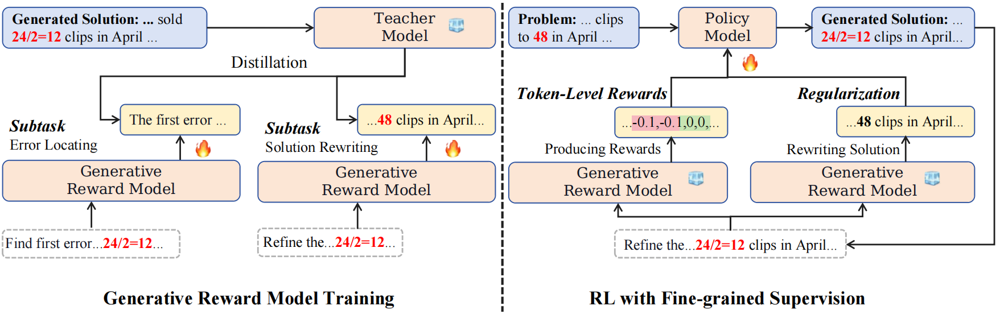

# RLMEC
This repo provides the source code & data of our paper: [Improving Large Language Models via Fine-grained Reinforcement Learning with Minimum Editing Constraint](https://arxiv.org/abs/2401.06081) (arXiv 2024)

## Framework

Based on the sampled LLM solutions that contain errors, we train the generative reward model using the erroneous solution rewriting task and the distilled data with minimum editing constraint from the teacher model. Then, we perform RL training on the policy model (i.e., our LLM) with fine-grained supervision using the token-level RL objective and the imitation-based regularization.



## Usage

To run RLMEC, you need to set your Claude 2 API key in the `miniedit_tm_qa.py` and `miniedit_tm_qa.py`, and set the model path and data path in the scripts.

The procedure of RLMEC is as follows:

1. Utilize the policy model to generate samples.
```
cd process_data/Gen_Samples
bash scripts/run_inference_qa.sh
cd ../../
```

2. Distillate samples from the teacher model (i.e., Claude 2).
```
cd process_data/Minimum_Edit
bash scripts/run_miniedit_tm_qa.sh
cd ../../
```

3. Process data to train the generative reward model.
```
cd process_data/Gen_Training_Data
python gen_grm_data_qa.py
cd ../../
```

4. Utilize the distillated samples to train the generative reward model.
```
cd train
bash scripts/run_train_grm.sh
cd ..
```

5. Utilize the well trained generative reward model to rewrite the generated samples.
```
cd process_data/Minimum_Edit
bash scripts/run_miniedit_grm_qa.sh
cd ../../
```

6. Utilize the generative reward model to generate the fine-grained supervised signals.
```
cd process_data/Gen_Training_Data
python gen_rlmec_data_qa.py
cd ../../
```

7. Utilize the fine-grained supervised signals to train the policy model.
```
cd train
bash scripts/run_grain_rlmec.sh
cd ../
```

8. Evaluate the well trained policy model on the mathematical tasks and question-answering tasks.
```
cd evaluate/QA
bash run.sh
cd ../Math
bash scripts/run_eval.sh
cd ../../
```


## Citation
If you find that RLMEC is helpful for your work, please cite the follow paper.
```
@InProceedings{Chen-RLMEC-2024,
      title={Improving Large Language Models via Fine-grained Reinforcement Learning with Minimum Editing Constraint}, 
      author={Zhipeng Chen and Kun Zhou and Wayne Xin Zhao and Junchen Wan and Fuzheng Zhang and Di Zhang and Ji-Rong Wen},
      year={2024},
      eprint={2401.06081},
      archivePrefix={arXiv},
      primaryClass={cs.CL}
}
```
